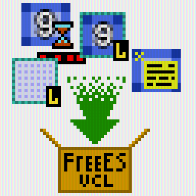
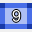
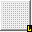
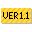
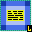
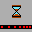
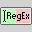

# ErrorSoft VCL Components
# Community update
*Release is dedicated to the emergence of a free version of the Delphi Community Edition!*  
*Релиз посвящен появлению бесплатной версии Delphi Community Edition!*  
**Version 3.0.5**  
The old version v2 here: https://github.com/errorcalc/FreeEsVclComponents/tree/Version2  

# If you need to install FreeEsVclComponents in several versions of Delphi, you can use   https://github.com/errorcalc/FreeEsVclComponents/blob/master/Packages/ for generate individual packages for every versions.

Free Open Source components for Delphi & C++Builder (VCL)
GetIt and Delphinus-Support

**This library is Open Source software, can be used this in commercial projects, modify, and distribute as source code or binary files.**  
This library licensed at two license: Modified MIT License (MIT) and GNU GPL v2.    
You can choose one of two license. See "LICENSE.txt"

**You can help, if you send me where you are using the component and attach a screenshot example of use**

**See [ReleaseNotes_en.pdf](Doc/ReleaseNotes_en.pdf) with a description of the new library features!**  
**Смотрите [ReleaseNotes_ru.pdf](Doc/ReleaseNotes_ru.pdf) с описанием новых возможностей библиотеки!**

# List of components:
* TEsLayout (Absolutely no flicker! Also for children TGraphicControl`s - BufferedChildrens property)
* TEsPanel (Absolutely no flicker! Also this support new frame styles)
* TEsPaintBox (Flicker free PaintBox)
* TEsImageLayout (Best for your application)
* TEsImageStaticText
* TEsNinePatchImage
* TEsImageLabel
* TEsActivityBar (Looks like Windows 10 XAML control!)
* TEsSwitch (Looks like Windows 10 XAML control!)
* TEsImage (Much better than the TImage)
* TEsImageControl (Much better than the TImage & absolutely no flicker!)
* TEsRegexpEdit
* TEsRegexButtonedEdit
* TEsRegexLabeledEdit
* TEsLinkLabel
* TEsVersionLabel

## XE2, XE3, XE4, XE5, XE6, XE7, XE8, RX10(Seattle), RX10.1(Berlin), RX10.2(Tokyo), RX10.3(Rio) - compatibility

# English ReadMe:

**EsVCLComponents** - Free ErrorSoft Vcl Components - a free library of VCL components for Delphi and C++Builder. This new controls and components to improve the appearance applications and to better user experience. All components has best support transparency, not flicker, and has support Interesting possibility for double buffering for TGraphicControl heirs. Components support visual styles and has modern style. 

Free use for commercial and non-commercial projects, you need specify in About, or anywhere else, that the program used components "EsVCLComponents" or link to this repository :)

If you'd like to support the EsVCLComponents or EsVclCore lib, you can do so at this link: 
### [Donate](https://www.paypal.com/cgi-bin/webscr?cmd=_donations&business=QZMJDXWS8GMU6&lc=US&item_name=FreeEsVclComponents&item_number=3&currency_code=RUB&bn=PP%2dDonationsBF%3abtn_donateCC_LG%2egif%3aNonHostedGuest)

You can help by giving an example of using the components in your projects(screenshot, description).

You can order developing vcl/fmx components, please submit requests to mail.

**Email:** errorsoft(at)mail.ru or dr.enter256@gmail.com

Features:
* Excellent support for transparency!
* No flicker!
* Support for built-in VCL skins
* Support Hight DPI (Berlin+)
* Display convenient borders in DesignTime, activate properties IsDrawHelper
* Windows XP support

**TEsCustomControl** - The base class contains the anti-flicker magic and support transparency.

**TEsNinePatchImage** - TImage for 9-Patch images (raster image with the ability to zoom without loss of quality, almost all modern interfaces are built on them), as well as images - Overlay

**TEsImageLabel** - The Label supports 9-Patch background image, and image - Overlay, the location and alignment of the text can be combined in different ways

**TEsLayout** - The basic container. Interesting possibility for double buffering TGraphicControl heirs (TLabel, TGlyphButton, TImage, TBevel ...)

**TEsPanel** - Flicker free Panel. It’s very nice replacement for TPanel, also this support new frame styles

**TEsLinkLabel** - Clickable link, opens a link on the Internet or local

**TEsVersionLabel** - Display current version of application

**TEsPaintBox** - Flicker free PaintBox. It’s very nice replacement for TPaintBox

**TEsImageLayout** - The Layout with support background 9-Patch images and image - Overlay

**TEsImageStaticText** - The StaticText supports 9-Patch background image, and image - Overlay, the location and alignment of the text can be combined in different ways

**TEsActivityBar** - Component simulates XAML control Windows 10, designed to indicate or display the progress of employment (something TProgressBar type). It has a lot of settings.
* Support for two display modes
* Three types of animation and progress indication
* Support VCL styles
* Lack of Flicker
* Full customization

**TEsSwitch** - Component simulates the eponymous XAML control Windows 10. It has a lot of settings. 
* Complete simulation XAML control 
* Animation 
* Support VCL styles
* Lack of Flicker 
* Full customization of colors 
* Multiple AutoSize-and modes 
* Support ActionList

**TEsImage** - Much better than the TImage, many other properties.
* Smoothing(Interpolation) support, this is always lacked TImage
* Support ImageList
* Support Opacity
* More Stretch modes

**TEsImageControl** - Much better than the TImage & absolutely no flicker!
* Absolutely no flicker!
* Smoothing(Interpolation) support, this is always lacked TImage
* Support ImageList
* Support Opacity
* More Stretch modes
* Draw frame if need
* Support Focusing

**TEsRegexEdit** - Edit with regular expression validation and indication.
* Customize colors
* Four indication modes
* Built-in regular expression editor

**TEsRegexButtonedEdit** - Buttoned edit with regular expression validation and indication.
* Customize colors
* Four indication modes
* Built-in regular expression editor

**TEsRegexLabeledEdit** - Labeled edit with regular expression validation and indication.
* Customize colors
* Four indication modes
* Built-in regular expression editor

**Look at other projects on this GitHub perhaps you might be interested ...**

# Russian ReadMe:
**ErrorsoftVCLComponents** - Free ErrorSoft Vcl Components - бесплатная библиотека VCL компонентов для Delphi и C++Builder. Это как новые элементы управления, так и компоненты для улучшения внешнего вида приложений и лучшего пользовательского опыта. Все компоненты имеет лучшую поддержку прозрачности, не мерцают, и имеет поддержку интересной возможности - двойная буферизация для наследников TGraphicControl. Компоненты поддерживают визуальные стили и имеет современный стиль. 

**Полностью бесплатная лицензия (в том числе для использования в коммерческих продуктах), открытый исходный код, необходимо только указать а About-е или где-нибудь в другом месте, что в программе используется данный набор компонент.**
**Автор будет благодарен, если будет ссылка на данный репозиторий :)**
**Также нельзя продавать данные компоненты и их производные, что, в общем то логично.**

Вы можете поддержать развитие проекта: 
### [Donate](https://www.paypal.com/cgi-bin/webscr?cmd=_donations&business=QZMJDXWS8GMU6&lc=US&item_name=FreeEsVclComponents&item_number=3&currency_code=RUB&bn=PP%2dDonationsBF%3abtn_donateCC_LG%2egif%3aNonHostedGuest)

**Вы можете помочь развитию библиотеки, если вы напишете мне, где вы используете компонент и приложите скриншот с примером использования**

Возможности:
* Превосходная поддержка прозрачности
* Отсутствие мерцания
* Поддержка встроенного в VCL движка тем
* Поддержка Hight DPI (Berlin+)
* Удобное отображение границ в DesignTime, при активации свойства IsDrawHelper
* Поддержка Windows XP

**TEsCustomControl** - Базовый класс, содержит в себе магию подавления мерцания и поддержки прозрачности.

**TEsNinePatchImage** - TImage для 9-Patch изображений (Растровое изображение с возможностью масштабирования, без потери качества, практически все современные интерфейсы строятся на них), а также изображения - Overlay-a

**TEsImageLabel** - Метка с возможностью установки фонового 9-Patch изображения, а также изображения - Overlay-a, расположение и выравнивание текста можно комбинировать

**TEsLayout** - Базовый компонент - контейнер.
Интересен возможностью двойной буферизации для наследников TGraphicControl (TLabel, TGlyphButton, TImage, TBevel...)

**TEsPanel** - Свободный от мерцания аналог TPanel. Отличная замена TPanel, поддерживающая новые стили фреймов

**TEsLinkLabel** - Кликабельная ссылка, открывает локальную или интернет ссылку

**TEsVersionLabel** - Отображает текущую версию приложения

**TEsPaintBox** - PaintBox свободный от мерцания, отличная замена стандартному мерцающему TPaintBox

**TEsImageLayout** - Layot с поддержкой фоновых 9-Patch изображений, а также изображения - Overlay-a

**TEsImageStaticText** - StaticText с поддержкой фоновых 9-Patch изображений, а также изображения - Overlay-a, и текста расположение и выравнивание текста можно комбинировать 

**TEsActivityBar** - Компонент имитирует XAML контрол Windows 10, созданный для индикации занятости или отображения прогресса (что-то типа TProgressBar).
Имеет множество настроек.
* Поддержка двух режимов отображения
* Три вида анимации и индикация прогресса
* Поддержка VCL тем
* Отсутствие мерцания
* Полная кастомизация

**TEsSwitch** - Компонент имитирует одноименный XAML контрол Windows 10.
Имеет множество настроек.
* Полная имитация XAML контрола
* Анимация
* Поддержка VCL тем
* Отсутствие мерцания
* Полная кастомизация цветов
* Несколько режимов AutoSize-а
* Поддержка ActionList

**TEsImage** - Лучшая замена TImage, с большими возможностями.
* Сглаживание, то чего всегда не хватало TImage
* Поддержка ImageList
* Поддержка полупрозрачности
* Несколько режимов растягивания изображения

**TEsImageControl** - Лучшая замена TImage, с большими возможностями и с отсутствием мерцания!
* Отсутствие мерцания!
* Сглаживание, то чего всегда не хватало TImage
* Поддержка ImageList
* Поддержка полупрозрачности
* Несколько режимов растягивания изображения
* Рисование границы, если необходимо
* Поддержка фокуса ввода

**TEsRegexEdit** - TEdit со встроенной поддержкой валидации и индикации правильности ввода с помощью регулярных выражений.
* Настройка цвета
* Четыре режима индикации
* Встроенный редактор регулярных выражений

**TEsRegexButtonedEdit** - TButtonedEdit со встроенной поддержкой валидации и индикации правильности ввода с помощью регулярных выражений.
* Настройка цвета
* Четыре режима индикации
* Встроенный редактор регулярных выражений

**TEsRegexLabeledEdit** - TLabeledEdit со встроенной поддержкой валидации и индикации правильности ввода с помощью регулярных выражений.
* Настройка цвета
* Четыре режима индикации
* Встроенный редактор регулярных выражений

Пишите ваши отзывы, а также пожелания по улучшению :)

**Email:** errorsoft(at)mail.ru

Более оперативно на вопросы я могу ответить здесь: http://vk.com/errorsoft

Совместима с Delphi/C++Builder, начиная с XE2
(Хотя класс **TEsCustomControl** будет полезен и ценителям Delphi 7)

**Посмотрите на другие проекты на этом GitHub, возможно, вы будете заинтересованы ...**
